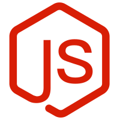

### Hi there 👋

<!-- **HiFxs/HiFxs** is a ✨ _special_ ✨ repository because its `README.md` (this file) appears on your GitHub profile. -->

Here are some ideas to get you started:

- 🔭 I’m currently working on Full Stack engineer
- 🌱 I’m currently learning IOT
- 👯 I’m looking to collaborate on Java/Spring project
- 🤔 I’m looking for help with architecture design
- 💬 Here is my blog's site: https://www.cnblogs.com/xhj928675426/
- 📫 How to reach me: 18381459825@163.com
- 😄 Pronouns: HiFxs

### :zap: Languages I use

 

### :rocket: Some of the technologies I have worked with

